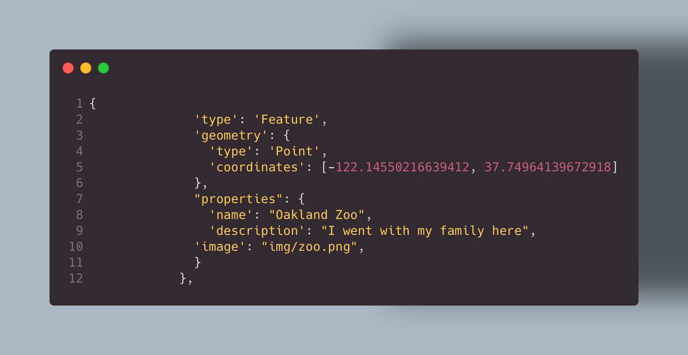

# Cool places I've gone to

## What this project is about
This project is just basically the places I've been to with my family.
## Why it's useful
this is useful for me since I can keep track of the places I've been to.
## Code Spot Light
Some code spot lights are me trying to debug an issue when adding more points to the map, and also when I almost deleted my whole code by accident.

This code snippet basically shows the code that adds the red points and it's coordinates. This is the code I struggled to understand since I wanted to add extra points on the map. 

_In the end the solution was as simple as copying the code and adding the new coordinates._

All of the tools I've used to make this were .
1. [Visual Studio Code](https://code.visualstudio.com/download) with [Live Server](https://marketplace.visualstudio.com/items?itemName=ritwickdey.LiveServer) and [Markdown All in One](https://marketplace.visualstudio.com/items?itemName=yzhang.markdown-all-in-one) extensions
2. [Mapbox GL JS](https://docs.mapbox.com/mapbox-gl-js/guides) Library for styling and displaying the map
3. and [GitHub pages](https://docs.github.com/en/pages/getting-started-with-github-pages/creating-a-github-pages-site) for publishing this app
#### demo
   

## Contributions
Anybody can contribute by adding a point to the map and therefore me going to that place and adding on to that point.

I encourage users to copy my map and make interesting maps like restaurant finders or Burrito finders.

And finally all credits go to @domlet for providing me the repo I forked to make this map.